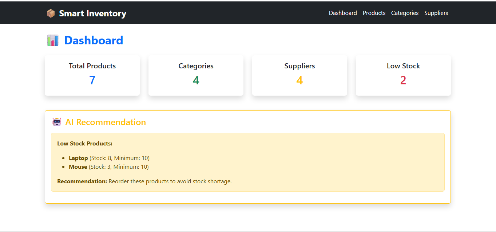
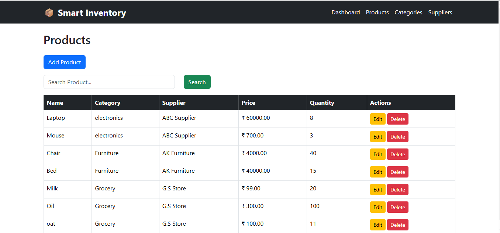
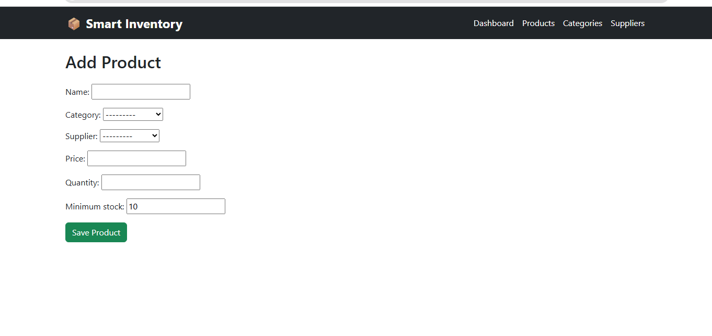
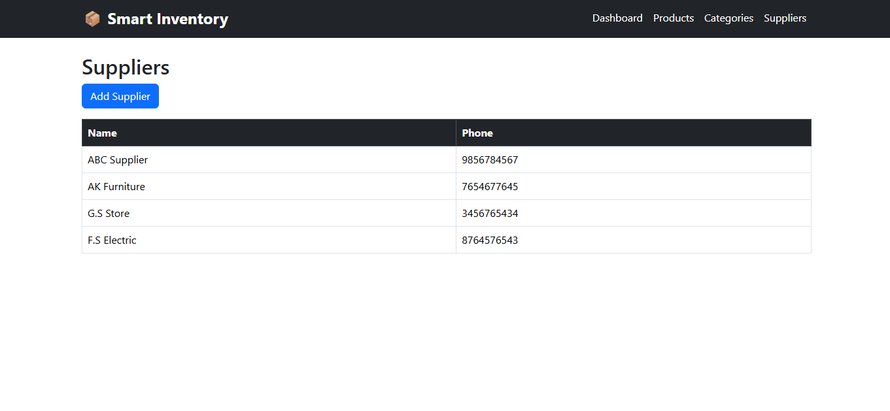
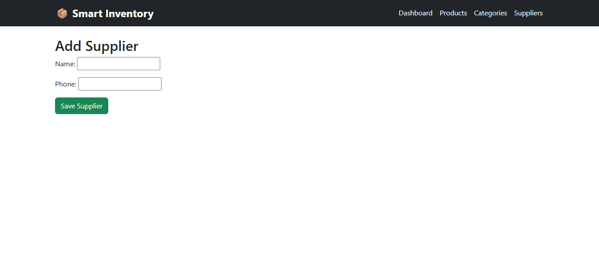

# 📦 Smart Inventory Management System

A Django-based Inventory Management System developed using **Python, Django, MySQL, and Bootstrap**. This application helps businesses manage products, categories, suppliers, and inventory efficiently.

---

## 🚀 Features

- 📊 Dashboard
- 📦 Product Management (CRUD)
- 📂 Category Management
- 🚚 Supplier Management
- 🔍 Product Search
- 📉 Low Stock Detection
- 💡 Smart Inventory Recommendation
- 🗄️ MySQL Database Integration
- 📱 Responsive Bootstrap UI

---

## 🛠️ Tech Stack

- Python
- Django
- MySQL
- HTML
- CSS
- Bootstrap 5
- Git & GitHub

---

# 📸 Project Screenshots

## Dashboard



---

## Products



---

## Add Product



---

## Categories


---

## Add Category


---

## Suppliers



---

## Add Supplier



---

## ⚙️ Installation

```bash
git clone https://github.com/Afzal0877/AI_Inventory_Management_System.git
```

```bash
cd AI_Inventory_Management_System
```

```bash
pip install -r requirements.txt
```

```bash
python manage.py migrate
```

```bash
python manage.py runserver
```

Open:

```
http://127.0.0.1:8000/
```

---

## 🎯 Future Improvements

- User Authentication
- Export Reports (Excel/PDF)
- Charts & Analytics

---

## 👨‍💻 Developed By

**Afzal Khan**

GitHub:
https://github.com/Afzal0877
